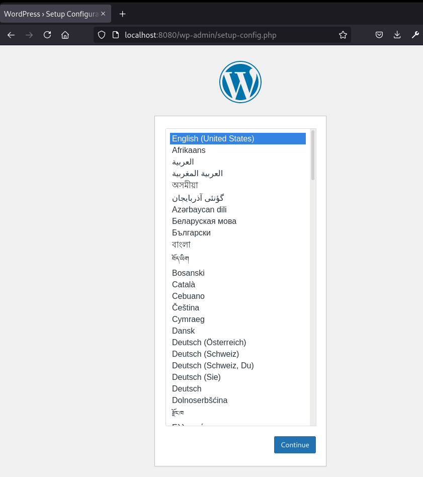
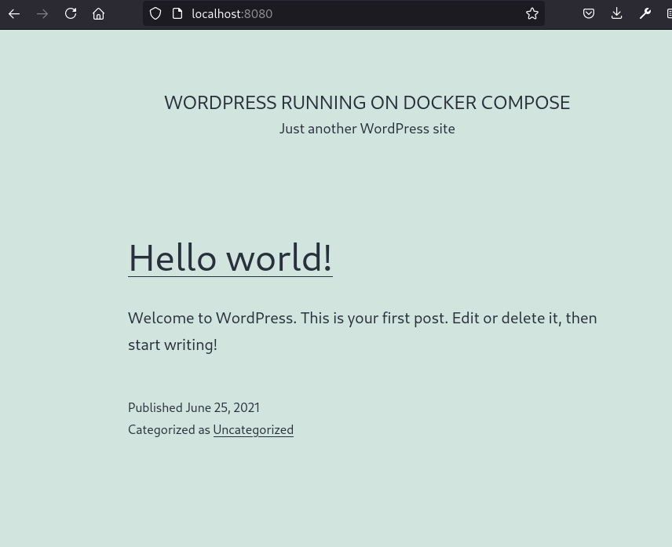

# Docker Compose Example for WordPress

## How to Use
Clone the repository to a directory of your choice or the default directory which is the name of this repository. Then, run:  

```
docker-compose up
```




